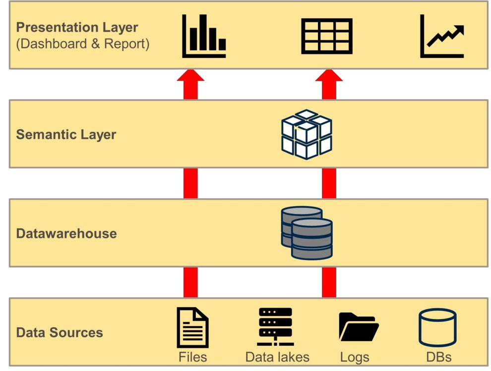

==**Terry:**==

- I waist a lot of energy during last 3 months
- Uncertainty
- I still not sure about my university
- Main question, what is the priority of a KTP project?
    - Academic contribution
    - Commercial product
- Visa Issue, I want to ask for the Global Talent endorsement from HR. And I need your support.

To-do:

- ==marketable for the future from job description==   
- ==Ask Helen for the Global Talent endorsement from HR.==
- ==AKT - link in the email==

\--------------------------------------------------------------------------------------------------------------------------------

Mohammad:

- Code 
- Commercial business 
- Fargro team

\--------------------------------------------------------------------------------------------------------------------------------

Best KTP averred:

- **==2025 the 50 years anniversary==** 

&nbsp;

\--------------------------------------------------------------------------------------------------------------------------------

Alison:

To-Do:

- ==Send the cost to the Alison==

&nbsp;

\--------------------------------------------------------------------------------------------------------------------------------

==**Simeon Report:**==

As a scientist, I am more eager to publish my personal ideas than anyone else.

Furthermore, this project has a greater academic capacity.

But ......

There are some concerns that need to be addressed.

First:

- The publications' MS is in the last 3 or 4 months of the project.

&nbsp;

Second:

- As a Fargro asset, how can I make an academic contribution to the university?
- If I am not mistaken, I am also a member of the university's academic staff.

&nbsp;

To-Do:

- ==To be in the conferences to present the paper and publication.==
- ==The IP is very important. the objective of the Terry.==

&nbsp;

\--------------------------------------------------------------------------------------------------------------------------------

&nbsp;

&nbsp;