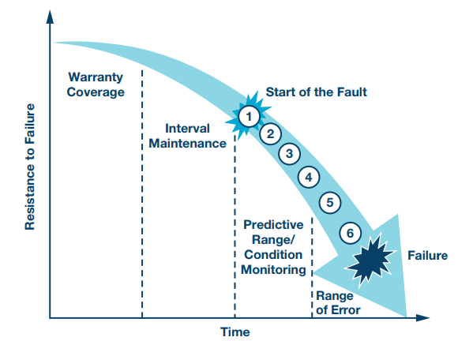
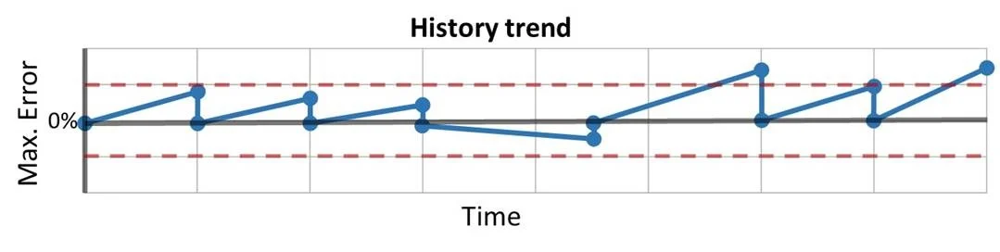

1.  **Comprehensive IoT Data Quality Control in Several Reliability:**
    - Completeness
        - Inter arrival Time Outliers
    - Consistency
        - Inter arrival Time Regularity
        - Inter arrival Time Duplicate
        - Sequential Dependencies
    - Timeliness
    - Validity
    - Effective Defect Density
    - Accuracy
    - Rate of Sensor Error
    - Reliability
    - Mean Time Between Failures
    - Quality of Sensor Code
    - ==Process Tolerance==
2.  **Our Sensor Management System:**
    - Data Quality Assurance
    - Sensor Condition Monitoring 
    - Sensor Replacement plan
    - Sensor Calibration plan
        - Measurement criticality
        - Model Tolerance Requirements
    - 