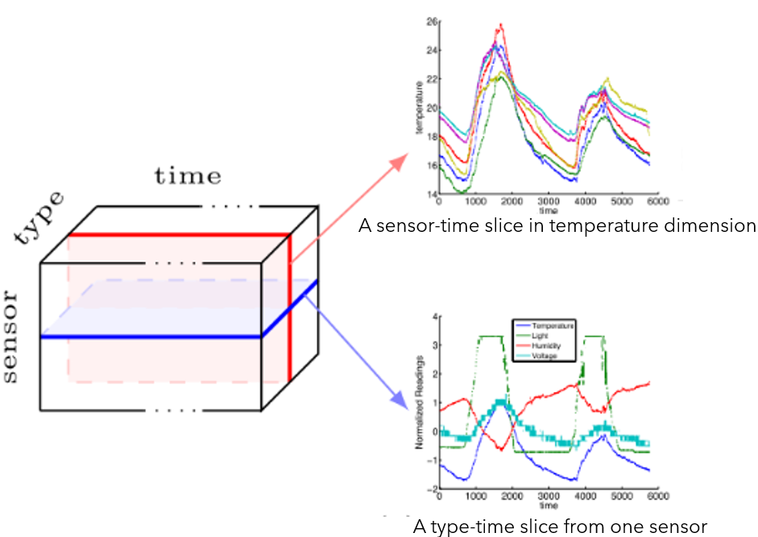

- I have to really advances mathematical solutions to:
    - Optimise the number of the sensors to have an efficient coverage of the greenhouse.
    - Choose a optimal type-topology
- **Tensor Decomposition**
    - In the Modern neural networks for solving complex
    - computer vision (CV) and Natural Language Processing (NLP) tasks
    - to achieve significant reductions in model size, run-time and energy consumption
- 
- **Sensor Fusion**
    - A mathematical method, used is **robotic** to reduce the uncertainty and noise of individual sensor measurements.

**TO:**

- Optimise the cost of the hardware, sensors and infrastructure including the installation, calibration, maintenance, cloud services, etc.